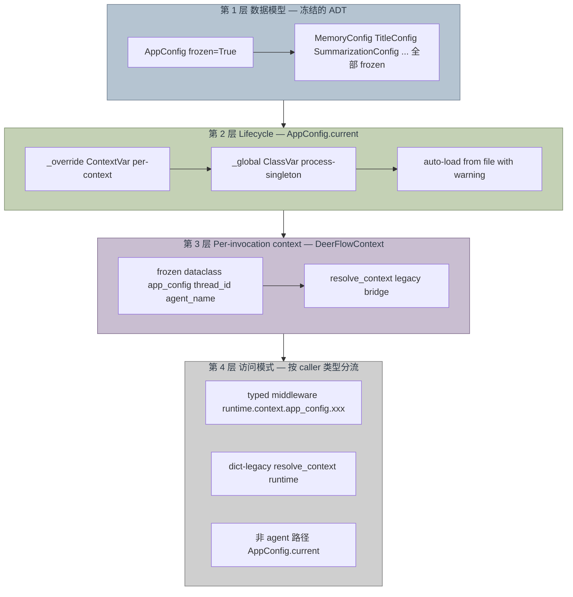

# DeerFlow 配置系统设计

> 对应实现：[PR #2271](https://github.com/bytedance/deer-flow/pull/2271) · RFC [#1811](https://github.com/bytedance/deer-flow/issues/1811) · 归档 spec：[config-refactor-design](./plans/2026-04-12-config-refactor-design.md)

## 1. 为什么要重构

重构前的 `deerflow/config/` 有三个结构性问题，凑在一起就是"全局可变状态 + 副作用耦合"的经典反模式：

| 问题 | 具体表现 |
|------|----------|
| 双重真相 | 每个 sub-config 同时是 `AppConfig` 字段**和**模块级全局（`_memory_config` / `_title_config` …）。consumer 不知道该信哪个 |
| 副作用耦合 | `AppConfig.from_file()` 顺便 mutate 8 个 sub-module 的 globals（通过 `load_*_from_dict()`） |
| 隔离不完整 | 原有的 `ContextVar` 只罩住 `AppConfig` 本体，8 个 sub-config globals 漏在外面 |

从类型论视角看：config 本应是一个**纯值对象（value object）**——构造一次、不变、可复制——但上面这套设计让它变成了"带全局状态的活对象"，于是 test mutation、async 边界、热更新都会互相污染。

## 2. 核心设计原则

> **Config is a value object, not live shared state.**
> 构造一次，不可变，没有 reload。新 config = 新对象 + 重建 agent。

这一条原则推导出后面所有决策：

- 全部 config model `frozen=True` → 非法状态不可表示
- `from_file()` 是纯函数 → 无副作用
- 没有 "热加载"语义 → 改变配置等于"拿到新对象"，由调用方决定要不要换进程全局

## 3. 四层分层



### 3.1 第 1 层：冻结的 ADT

所有 config model 都是 Pydantic `frozen=True`。

```python
class MemoryConfig(BaseModel):
    model_config = ConfigDict(frozen=True)
    enabled: bool = True
    storage_path: str | None = None
    ...

class AppConfig(BaseModel):
    model_config = ConfigDict(extra="allow", frozen=True)
    memory: MemoryConfig
    title: TitleConfig
    ...
```

改 config 用 copy-on-write：

```python
new_config = config.model_copy(update={"memory": new_memory_config})
```

**从类型论视角**：这就是个 product type（record），所有字段组合起来才是一个完整的 `AppConfig`。冻结意味着 `AppConfig` 是**指称透明**的——同样的输入永远拿到同样的对象。

### 3.2 第 2 层：Lifecycle — `AppConfig.current()`

这层是整个设计最值得讲的一块。它不是一个简单的单 `ContextVar`，而是**三层 fallback**：

```python
class AppConfig(BaseModel):
    ...

    # 进程级单例。GIL 下原子指针交换，无需锁
    _global: ClassVar[AppConfig | None] = None

    # Per-context override，用于测试隔离和多 client
    _override: ClassVar[ContextVar[AppConfig]] = ContextVar("deerflow_app_config_override")

    @classmethod
    def init(cls, config: AppConfig) -> None:
        """设置进程全局。对所有后续 async task 可见"""
        cls._global = config

    @classmethod
    def set_override(cls, config: AppConfig) -> Token[AppConfig]:
        """Per-context 覆盖。返回 Token 给 reset_override()"""
        return cls._override.set(config)

    @classmethod
    def reset_override(cls, token: Token[AppConfig]) -> None:
        cls._override.reset(token)

    @classmethod
    def current(cls) -> AppConfig:
        """优先级：per-context override > 进程全局 > 自动从文件加载（warning）"""
        try:
            return cls._override.get()
        except LookupError:
            pass
        if cls._global is not None:
            return cls._global
        logger.warning("AppConfig.current() called before init(); auto-loading from file. ...")
        config = cls.from_file()
        cls._global = config
        return config
```

**为什么是三层，不是一层？**

| 原因 | 解释 |
|------|------|
| 单 ContextVar 行不通 | Gateway 收到 `PUT /mcp/config` reload config，下一个请求在**全新的 async context** 里跑——ContextVar 的值传不过去。只能用进程级变量 |
| 保留 ContextVar override | 测试需要 per-test scope config，`Token`-based reset 保证干净恢复。多 client 场景如果真出现也能靠它 |
| Auto-load fallback | 有些 call site 历史上没调 `init()`（内部脚本、import-time 触发的测试）。加 warning 保证信号不丢，但不硬崩 |

**Scala 视角的映射**：

- `_global` = 进程级 `var`，脏，但别无选择
- `_override` = `Option[ContextVar]` 形式的 reader monad 层
- `current()` = fallback chain `override.orElse(global).orElse(autoLoad)`，和 `Option.orElse` 思路一致

**为什么 `_global` 没加锁？**

因为读和写都是单个指针赋值（assignment of class attribute），在 CPython 的 GIL 下是原子的。如果将来改成 read-modify-write（比如 "如果没 init 就 init 成 X"），再加 `threading.Lock`。现在不加是因为——不需要。

### 3.3 第 3 层：`DeerFlowContext` — per-invocation typed context

```python
# deerflow/config/deer_flow_context.py
@dataclass(frozen=True)
class DeerFlowContext:
    """Typed, immutable, per-invocation context injected via LangGraph Runtime"""
    app_config: AppConfig
    thread_id: str
    agent_name: str | None = None
```

为什么不把 `thread_id` 也放进 `AppConfig`？

- `AppConfig` 是**配置**——进程启动时确定，所有请求共享
- `thread_id` 是**每次调用变的运行时身份**——必须 per-invocation

两者是不同的 category，混在一起就是把静态配置和动态 identity 耦合。

**注入路径**：

```python
# Gateway worker（主路径）
deer_flow_context = DeerFlowContext(
    app_config=AppConfig.current(),
    thread_id=thread_id,
)
agent.astream(input, config=config, context=deer_flow_context)

# DeerFlowClient
AppConfig.init(AppConfig.from_file(config_path))
context = DeerFlowContext(app_config=AppConfig.current(), thread_id=thread_id)
agent.stream(input, config=config, context=context)
```

LangGraph 的 `Runtime` 会把 `context=...` 的值注入到 `Runtime[DeerFlowContext].context` 里。Middleware 拿到的就是 typed 的 `DeerFlowContext`。

**不进 context 的东西**：`sandbox_id`——它是 mid-execution 才 acquire 的**可变运行时状态**，正确的归宿是 `ThreadState.sandbox`（state channel，有 reducer），不是 context。原先 `sandbox/tools.py` 里 3 处 `runtime.context["sandbox_id"] = ...` 的写法全部删除。

### 3.4 第 4 层：访问模式按 caller 类型分流

三种 caller，三种模式：

| Caller 类型 | 访问模式 | 例子 |
|-------------|----------|------|
| Typed middleware（签名写 `Runtime[DeerFlowContext]`） | `runtime.context.app_config.xxx` 直读，无包装 | `memory_middleware` / `title_middleware` / `thread_data_middleware` 等 |
| 可能遇到 dict context 的 tool | `resolve_context(runtime).xxx` | `sandbox/tools.py`（dict-legacy 路径）/ `task_tool.py`（bash subagent gate） |
| 非 agent 路径（Gateway router、CLI、factory） | `AppConfig.current().xxx` | `app/gateway/routers/*` / `reset_admin.py` / `models/factory.py` |

**关键简化**（commit `a934a822`）：原本所有 middleware 都走 `resolve_context()`，后来发现既然签名已经是 `Runtime[DeerFlowContext]`，包装就是冗余防御，直接 `runtime.context.app_config.xxx` 就行。同时也把 `title_middleware` 里每个 helper 的 `title_config=None` fallback 都删掉了——**required parameter 不给 default**，让类型系统强制 caller 传对。

这对应 Scala / FP 的两个信条：
- **让非法状态不可表示**（`Option[TitleConfig]` 改成 `TitleConfig` required）
- **Let-it-crash**（config 解析失败是真 bug，surface 出来比吞掉退化更好）

## 4. `resolve_context()` 的三种分支

`resolve_context()` 自己还在，处理三种 runtime.context 形状：

```python
def resolve_context(runtime: Any) -> DeerFlowContext:
    ctx = getattr(runtime, "context", None)

    # 1. typed 路径（Gateway、Client）— 直接返回
    if isinstance(ctx, DeerFlowContext):
        return ctx

    # 2. dict-legacy 路径（老测试、第三方 invoke）— 桥接
    if isinstance(ctx, dict):
        thread_id = ctx.get("thread_id", "")
        if not thread_id:
            logger.warning("...empty thread_id...")
        return DeerFlowContext(
            app_config=AppConfig.current(),
            thread_id=thread_id,
            agent_name=ctx.get("agent_name"),
        )

    # 3. 完全没 context — fall back 到 LangGraph configurable
    cfg = get_config().get("configurable", {})
    return DeerFlowContext(
        app_config=AppConfig.current(),
        thread_id=cfg.get("thread_id", ""),
        agent_name=cfg.get("agent_name"),
    )
```

空 thread_id 会 warn，不会硬崩——在这里 warn 比 crash 合理，因为 `thread_id` 缺失只影响文件路径（落到空字符串目录），不会让整个 agent 跑崩。

## 5. Gateway config 热更新流程

历史上 Gateway 用 `reload_*_config()` 带 mtime 检测。现在改成：

```
写 extensions_config.json → AppConfig.init(AppConfig.from_file()) → 下一个请求看到新值
```

**没有**：mtime 检测、自动刷新、`reload_*()` 函数。

哲学很简单：**结构性变化（模型、tools、middleware 链）需要重建 agent；运行时变化（`memory.enabled` 这种 flag）下一次 invocation 从 `AppConfig.current()` 取值就自动生效**。不需要给 config 做"活对象"语义。

## 6. 从原计划的分歧

三处关键分歧（详情见 [归档 spec §7](./plans/2026-04-12-config-refactor-design.md#7-divergence-from-original-plan)）：

| 分歧 | 原计划 | Shipped | 原因 |
|------|--------|---------|------|
| Lifecycle 存储 | 单 ContextVar，`ConfigNotInitializedError` 硬崩 | 3 层 fallback，auto-load + warning | ContextVar 跨 async 边界传不过去 |
| 模块位置 | 新建 `context.py` | Lifecycle 放在 `AppConfig` 自身 classmethod | 减一层模块耦合 |
| Middleware 访问 | 处处 `resolve_context()` | typed middleware 直读 `runtime.context.xxx` | 类型收紧后防御性包装是 noise |

## 7. 从 Scala / Actor 视角的几点观察

- **`AppConfig` 就是个 case class / ADT**。`frozen=True` 相当于 Scala 的 final case class：构造完就不动。改动靠 `model_copy(update=…)`，对应 Scala 的 `copy(…)`。
- **`DeerFlowContext` 是 typed reader**。Middleware 接收 `Runtime[DeerFlowContext]`，本质是 `Kleisli[DeerFlowContext, State, Result]`——依赖注入，类型化。比 `RunnableConfig.configurable: dict[str, Any]` 强太多。
- **`resolve_context()` 是适配层**。存在是因为有三种不同形状的上游输入；在纯 FP 眼里这是个 `X => DeerFlowContext` 的 total function，通过 pattern match 三种 case 把世界收敛回 typed 的那条路径。
- **Let-it-crash 的体现**：commit `a934a822` 干掉 middleware 里 `try/except resolve_context(...)`，干掉 `TitleConfig | None` 的 defensive fallback。Config 解析失败就让它抛出去，别吞成"degraded mode"——actor supervision 会处理，吞错反而藏 bug。
- **进程 global 的妥协**：`_global: ClassVar` 是这套设计里唯一违背纯值的地方。但在 Python async + HTTP server 的语境里，你没别的办法跨 request 把"新 config"传给所有 task。承认妥协、限制范围（只在 lifecycle 层一个变量）、周边全部 immutable——这就是工程意义上的"合理妥协"。

## 8. Cheat sheet

想访问 config，怎么办？按你写代码的位置看：

| 我在写什么 | 用什么 |
|------------|--------|
| Typed middleware（签名 `Runtime[DeerFlowContext]`） | `runtime.context.app_config.xxx` |
| Typed tool（`ToolRuntime[DeerFlowContext]`） | `runtime.context.xxx` |
| 可能被老调用方以 dict context 调到的 tool | `resolve_context(runtime).xxx` |
| Gateway router、CLI、factory、测试 helper | `AppConfig.current().xxx` |
| 启动时初始化 | `AppConfig.init(AppConfig.from_file(path))` |
| 测试里想临时改 config | `token = AppConfig.set_override(cfg)` / `AppConfig.reset_override(token)` |
| Gateway 写完新 `extensions_config.json` 之后 | `AppConfig.init(AppConfig.from_file())`，然后让 agent 重建（如果结构变了） |

不要：
- ~~`get_memory_config()` / `get_title_config()` 等旧 getter~~（已删）
- ~~`reload_app_config()` / `reset_app_config()`~~（已删）
- ~~`_memory_config` 等模块级 global~~（已删）
- ~~`runtime.context["sandbox_id"] = ...`~~（走 `runtime.state["sandbox"]`）
- ~~防御性 `try/except resolve_context(...)`~~（让它崩）
